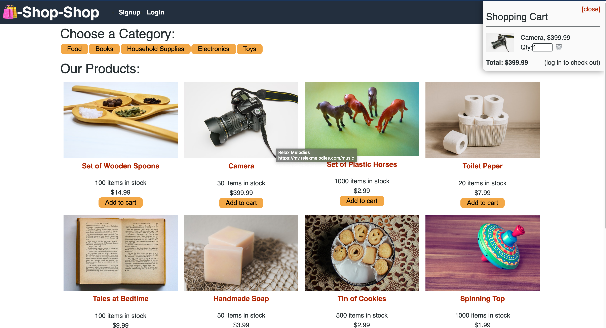

# Redux Store

## Description

Redux Store is a react app that uses Redux as a state management tool. It lets the user after logging in or signing up choose products from mulitple categories and add them to the shopping cart.

## Installation

- Run the command `npm i` to install all necessary packages

## Usage

Run the command `npm start` to run the app

After logging in/Signing up, click on a product on the page and click "Add to cart", then follow the checkout process and see the purchased item in order history

## Built With

React

Redux

Apollo

GraphQL

MongoDB

Mongoose

## Deployed Link

https://still-bastion-76655.herokuapp.com/

## Authors

hugh18019
GitHub Profile: https://github.com/hugh18019

## License

Licensed under the [MIT License](LICENSE).
